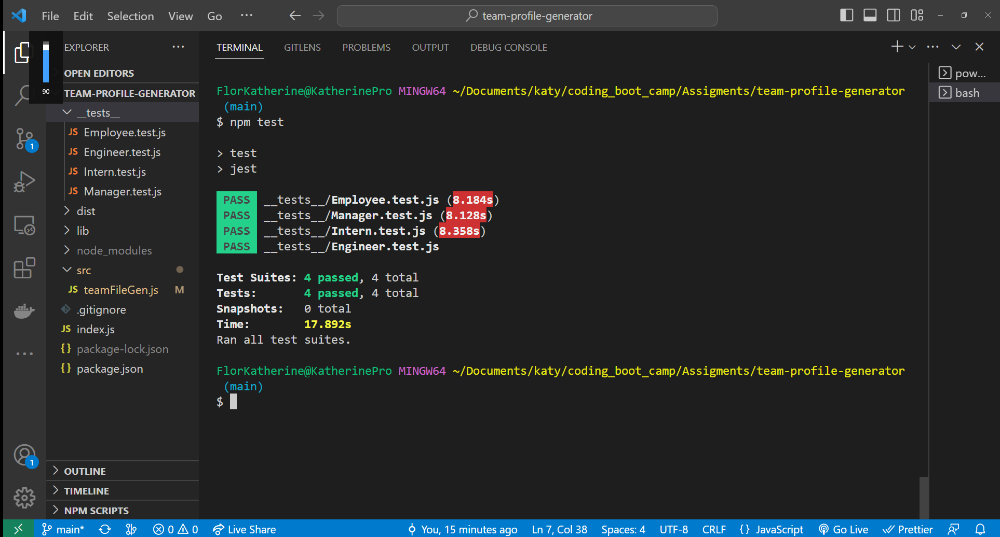
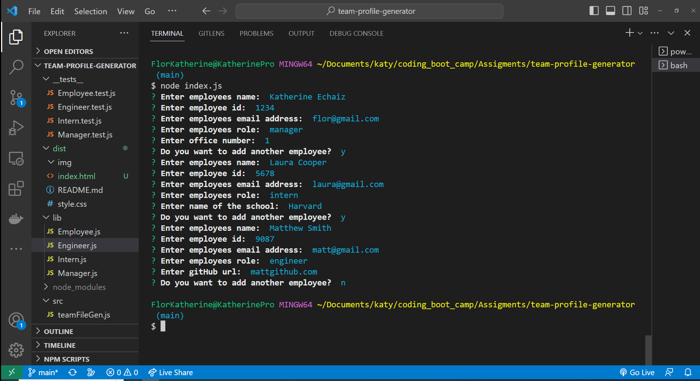
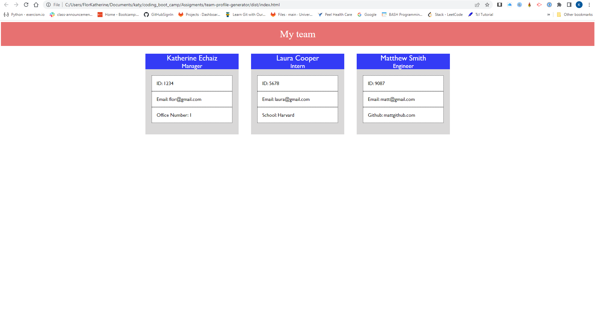

# Team Profile Generator
This application creates employees profiles to be displayed in an Html file.
It also perfoms tests on the Employee, Manager, Engineer and Intern objects.
After running the application with the node index.js command, the user is 
prompted for the name, id number, email and role.

 The role must be entered with capital letter at the beginning of the word.

Once the information is entered the app asks the user whether to continue creating another profile or exit, this is answered writting "y" or "n". 

If "n" is entered the program creates a html file displaying the profiles with
the information received.

# Screenshots

# Links
Link to the walk through video:
<https://drive.google.com/file/d/1qXdQFyT05xykyckEPj6SBckfne9fSe9o/view>

Link to the github repository:
<https://github.com/katita81/team-profile-generator>

